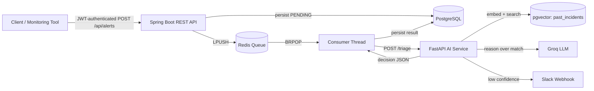

# IncidentSense — Autonomous Incident Triage System

> A hybrid **Spring Boot + Python (FastAPI)** system that ingests production incident alerts, retrieves semantically similar past incidents using vector search, and uses a hybrid decision layer to either auto-suggest a fix or escalate to a human — with JWT-based authentication and role-based access control securing every endpoint.


---

## Table of Contents

- [What This Project Does](#what-this-project-does)
- [Project Status](#project-status)
- [Architecture](#architecture)
- [Why This Architecture?](#why-this-architecture)
- [Authentication & Authorization](#authentication--authorization)
- [Tech Stack](#tech-stack)
- [Project Structure](#project-structure)
- [How the Decision Logic Works](#how-the-decision-logic-works)
- [Database Schema](#database-schema)
- [Installation](#installation)
- [Running the Project](#running-the-project)
- [API Reference](#api-reference)
- [Architecture Decisions](#architecture-decisions)
- [Known Limitations](#known-limitations)
- [Roadmap](#roadmap)
- [Author](#author)

---

## What This Project Does

When a production system throws an error, an on-call engineer usually has to manually figure out: *"Have we seen this before? What fixed it last time? Is this even worth waking someone up for?"*

This system automates that first triage step:

1. An authenticated alert (a raw log/error message) comes in through a REST API.
2. It's persisted and queued, then picked up asynchronously by a background consumer.
3. A Python AI service embeds the alert and searches a vector database of past resolved incidents for semantically similar cases — not just keyword matches.
4. A hybrid decision layer combines a cheap distance threshold with an LLM verification step to decide:
   - **High-confidence match found** → auto-suggest the fix that worked last time.
   - **No good match / genuinely novel issue** → escalate to a human via Slack.
5. The full decision — including the reasoning, the matched past incident, and the confidence distance — is persisted for later review, and can be approved, rejected, or manually resolved by a human, feeding the outcome back into the knowledge base.

---

## Project Status

Built incrementally, day by day, with a focus on understanding every layer rather than scaffolding it with a template.

| Component | Status |
| --- | --- |
| FastAPI service (Python) — alert ingestion & classification | Done |
| LLM-based severity/category classification | Done |
| Retrieval pipeline — embeddings + pgvector cosine search | Done |
| Synthetic incident knowledge base (LLM-seeded) | Done |
| Hybrid decision layer (distance threshold + LLM verification) | Done |
| Slack escalation webhook | Done |
| Spring Boot ingestion API + Redis queue (producer/consumer) | Done |
| Spring Boot ↔ Python service integration (WebClient) | Done |
| React dashboard (board, analytics, knowledge base views) | Done |
| Rate limiting (Bucket4j) | Done |
| **JWT authentication + role-based access control** | Done |
| **Soft-delete / restore for alerts** | Done |
| **Multi-field search with status filtering** | Done |
| **Self-referencing duplicate linking** | Done |
| Human review loop (approve/reject/resolve → feeds knowledge base) | Done |
| Retry with exponential backoff | Done |
| Deployment (Render/Railway/Supabase/Vercel) | Planned |
| Redis Streams / delivery-guarantee hardening | Planned |

---

## Architecture



The system is split into two independently runnable services that share a single PostgreSQL database:

- **Spring Boot** owns ingestion, auth/RBAC, queueing, orchestration, and persistence of the final decision.
- **Python (FastAPI)** owns everything AI-related: embeddings, vector search, LLM reasoning, and the decision logic.

---

## Why This Architecture?

**Why hybrid Java + Python instead of one stack end-to-end?**
Core business logic (auth, orchestration, persistence) sits in a statically-typed, enterprise-grade stack, while AI/ML-specific work uses the ecosystem actually built for it — mature libraries for embeddings, vector clients, and LLM SDKs. Each half plays to its stack's strengths.

**Why Redis as a queue instead of a direct synchronous call?**
LLM calls and vector search take anywhere from a few hundred milliseconds to a few seconds. A synchronous call would let a burst of alerts exhaust the web server's thread pool. Queueing decouples ingestion from processing: ingestion always responds fast (`202 Accepted`), and processing happens asynchronously.

**Why pgvector instead of a dedicated vector database?**
Incident data is relational as much as it is semantic. Keeping vectors inside PostgreSQL means relational and vector data can be joined directly, with one less moving part in the infrastructure. At this project's scale, operational simplicity outweighs the raw performance ceiling a dedicated vector store offers at much larger scale.

**Why a hybrid threshold + LLM confidence check, instead of pure vector similarity or pure LLM judgment?**
Distance is a cheap pre-filter that rejects clearly-unrelated alerts immediately; an LLM call is only spent reasoning about genuinely close candidates — cutting cost without sacrificing judgment on ambiguous cases.

---

## Authentication & Authorization

Every alert and triage-result endpoint is secured with stateless JWT authentication and role-based access control, mirroring the same pattern used in the author's Issue Management System project.

**Roles**

| Role | Permissions |
| --- | --- |
| **ADMIN** | Full access — create, read, update, delete/restore alerts |
| **MANAGER** | Create, read, update alerts and triage results |
| **ANALYST** | Create, read, update alerts; mark duplicates; retry failed alerts |
| **VIEWER** | Read-only access to alerts, search, and analytics |

**Flow**

1. `POST /auth/register` creates a user with the default **VIEWER** role and returns a signed JWT.
2. `POST /auth/login` authenticates credentials via Spring Security's `DaoAuthenticationProvider` and returns a JWT.
3. Every subsequent request carries `Authorization: Bearer <token>`; a custom `OncePerRequestFilter` validates the token and populates the Spring Security context per-request (fully stateless — no server-side session).
4. Endpoint-level rules (`SecurityConfig`) and method-level `@PreAuthorize` enforce role checks.

**Security details**
- Passwords hashed with BCrypt, never stored in plaintext.
- JWT signed with HMAC-SHA512 using a secret sourced from an environment variable (`JWT_SECRET`) — no hardcoded fallback in production paths.
- CORS restricted to the configured frontend origin(s).

---

## Tech Stack

**Backend (Spring Boot)**
- Java 17, Spring Boot 3.x
- Spring Web, Spring Data JPA (Hibernate)
- Spring Security + JJWT (`0.12.x`) for stateless JWT authentication
- Spring Data Redis
- PostgreSQL driver
- Bucket4j for rate limiting
- Lombok
- `WebClient` (Spring WebFlux) for calling the Python service

**AI Service (Python)**
- FastAPI + Uvicorn (ASGI)
- Pydantic for request/response validation
- SQLAlchemy + `pgvector` (Python package) for ORM + vector column support
- `sentence-transformers` (`all-MiniLM-L6-v2`, 384-dim) for local embedding generation
- Groq API for classification and decision verification
- `requests` for Slack webhook calls

**Infrastructure**
- PostgreSQL 16 + pgvector extension (Dockerized)
- Redis (Dockerized)
- Docker for containerized deployment of both services

---

## Project Structure

```text
Triage Project/
├── ai-service/                          # Python — AI/retrieval/decision layer
│   ├── main.py                          # FastAPI app + all routes
│   ├── classifier.py                    # LLM-based severity/category classification
│   ├── embeddings.py                    # Text → 384-dim vector via sentence-transformers
│   ├── models.py                        # SQLAlchemy models (PastIncident) + DB session
│   ├── seed_data.py                     # LLM-generated synthetic incident seeding script
│   ├── retrieval.py                     # Top-k similar incident retrieval (cosine distance)
│   ├── agent.py                         # Decision layer: threshold + LLM verification
│   ├── requirements.txt
│   └── .env                             # GROQ_API_KEY, DATABASE_URL, SLACK_WEBHOOK_URL
│
└── incident-triage-spring-service/
    └── incident-triage-service/
        ├── Dockerfile
        └── src/main/java/com/pratham/incident_triage_service/
            ├── entity/
            │   ├── Alert.java              # Alert with status, soft-delete flag, self-referencing duplicates
            │   └── TriageResult.java        # Final decision, linked to Alert by alertId
            ├── model/
            │   ├── User.java                # Auth user with many-to-many roles
            │   ├── Role.java
            │   └── RoleType.java             # ADMIN / MANAGER / ANALYST / VIEWER
            ├── repository/
            │   ├── AlertRepository.java      # Custom JPQL: findByIdWithDuplicates, searchActiveAlerts
            │   ├── TriageResultRepository.java
            │   ├── UserRepository.java
            │   └── RoleRepository.java
            ├── dto/
            │   ├── AlertRequest.java, TriageResponse.java, AlertWithResult.java
            │   ├── LoginRequest.java, LoginResponse.java, RegisterRequest.java
            │   └── MarkDuplicateRequest.java
            ├── controller/
            │   ├── AlertController.java      # ingest, search, retry, soft-delete, restore, mark-duplicate, SSE stream
            │   ├── TriageResultController.java
            │   ├── AnalyticsController.java
            │   └── AuthController.java       # /auth/login, /auth/register
            ├── service/
            │   ├── AlertQueueProducer.java / AlertQueueConsumer.java
            │   ├── SseBroadcaster.java
            │   ├── AuthService.java
            │   └── CustomUserDetailsService.java
            ├── util/
            │   ├── JwtTokenProvider.java
            │   └── CustomUserDetails.java
            ├── config/
            │   ├── SecurityConfig.java, JwtAuthenticationFilter.java
            │   ├── RedisConfig.java, WebClientConfig.java, RateLimitConfig.java
            │   └── DataInitializationConfig.java   # seeds the four roles on startup
            └── IncidentTriageServiceApplication.java
```

---

## How the Decision Logic Works

For every alert, the AI service runs a two-stage decision process:

1. **Retrieve** the single closest past incident from `past_incidents` using pgvector's cosine distance operator (`<=>`) against the alert's embedding.
2. **Threshold pre-filter** — if the distance exceeds a tuned cutoff (currently `0.4`), the candidate is too dissimilar and the alert is escalated immediately, without spending an LLM call.
3. **LLM verification** — if the candidate passes the threshold, the LLM is given both the new alert and the candidate incident and asked to judge whether they're genuinely the same underlying issue. This catches cases where vector search finds something numerically close but conceptually different.
4. **Fail-safe default** — if the LLM's response can't be parsed as valid JSON, the system defaults to escalation rather than trusting an unverified match.

```python
DISTANCE_THRESHOLD = 0.4

def make_decision(alert_message: str) -> dict:
    top_match, distance = get_top_match_with_distance(alert_message)

    if top_match is None or distance > DISTANCE_THRESHOLD:
        return escalate(...)

    llm_verdict = llm_confirm_match(alert_message, top_match)
    if llm_verdict["is_match"]:
        return auto_suggest_fix(...)
    else:
        return escalate(...)
```

---

## Database Schema

Both services share a single PostgreSQL database (`triage_db`).

**Owned by the Python AI service**

| Table | Purpose |
| --- | --- |
| `past_incidents` | Knowledge base of resolved incidents: `log_message`, `severity`, `category`, `resolution`, `embedding VECTOR(384)` |

**Owned by the Spring Boot service**

| Table | Purpose |
| --- | --- |
| `alerts` | Ingested alerts with lifecycle status (`PENDING → PROCESSING → COMPLETED / FAILED`), soft-delete flag, and self-referencing duplicate links |
| `triage_results` | Final decision per alert: `decision`, `suggested_resolution`, `reasoning`, `confidence_distance`, human review status, linked via `alertId` |
| `users` / `roles` / `user_roles` | Authentication and role-based access control |

---

## Installation

### Prerequisites

- Java 17+, Maven
- Python 3.10+
- Docker Desktop
- A Groq API key ([console.groq.com](https://console.groq.com))
- (Optional) A Slack app with an Incoming Webhook

### Infrastructure (Docker)

```bash
docker run --name triage-postgres -e POSTGRES_PASSWORD=<password> -p 5432:5432 -d pgvector/pgvector:pg16
docker run --name triage-redis -p 6379:6379 -d redis
```

Enable the `vector` extension inside the database:

```bash
docker exec -it triage-postgres psql -U postgres
```
```sql
CREATE DATABASE triage_db;
\c triage_db
CREATE EXTENSION vector;
```

### AI Service (Python)

```bash
cd ai-service
python -m venv venv
venv\Scripts\Activate.ps1     # Windows
# source venv/bin/activate    # Mac/Linux
pip install -r requirements.txt
```

Create `ai-service/.env`:
```env
GROQ_API_KEY=your_key_here
DATABASE_URL=postgresql://postgres:<password>@localhost:5432/triage_db
SLACK_WEBHOOK_URL=https://hooks.slack.com/services/your/webhook/url
```

Create tables and seed the knowledge base:
```bash
python models.py
python seed_data.py
```

### Spring Boot Service

Set the following as environment variables (or in `application.properties`):

```properties
spring.datasource.url=jdbc:postgresql://localhost:5432/triage_db
spring.datasource.username=postgres
spring.datasource.password=<password>
spring.jpa.hibernate.ddl-auto=update
spring.data.redis.host=localhost
spring.data.redis.port=6379
python.service.url=http://localhost:8000
server.port=8080

jwt.secret=${JWT_SECRET}
jwt.expiration=86400000
app.cors.allowed-origins=http://localhost:5173
```

> Generate a strong JWT secret with `openssl rand -base64 64` — do not use a hardcoded or predictable value.

---

## Running the Project

**AI Service** (from `ai-service/`):
```bash
uvicorn main:app --reload --port 8000
```

**Spring Boot Service** — run `IncidentTriageServiceApplication` from your IDE, or:
```bash
./mvnw spring-boot:run
```

Both services must be running simultaneously, along with the two Docker containers.

---

## API Reference

### Auth (Spring Boot, `localhost:8080`)

| Endpoint | Method | Access | Description |
| --- | --- | --- | --- |
| `/auth/register` | `POST` | Public | Register a new user (default role: VIEWER) |
| `/auth/login` | `POST` | Public | Authenticate and receive a JWT |

### Alerts (Spring Boot, `localhost:8080`)

| Endpoint | Method | Access | Description |
| --- | --- | --- | --- |
| `/api/alerts` | `POST` | ANALYST, MANAGER, ADMIN | Ingest a new alert — persists, queues, returns `202 Accepted` |
| `/api/alerts` | `GET` | VIEWER+ | List all non-deleted alerts with their triage result |
| `/api/alerts/{id}` | `GET` | VIEWER+ | Fetch a single alert |
| `/api/alerts/search` | `GET` | VIEWER+ | Multi-field search (`source`, `message`) with optional status filter, paginated |
| `/api/alerts/{id}/retry` | `POST` | ANALYST, MANAGER, ADMIN | Re-queue a failed alert |
| `/api/alerts/{id}/mark-duplicate` | `POST` | ANALYST, MANAGER, ADMIN | Link an alert to another as a duplicate |
| `/api/alerts/{id}` | `DELETE` | ADMIN | Soft-delete an alert |
| `/api/alerts/{id}/restore` | `PUT` | ADMIN | Restore a soft-deleted alert |
| `/api/alerts/stream` | `GET` | Public (SSE) | Server-sent events for real-time dashboard updates |

### Triage Results & Analytics (Spring Boot, `localhost:8080`)

| Endpoint | Method | Access | Description |
| --- | --- | --- | --- |
| `/api/triage-results/{id}/review` | `POST` | ANALYST, MANAGER, ADMIN | Approve/reject an auto-suggested fix; approved fixes are learned back into the knowledge base |
| `/api/triage-results/{id}/resolve` | `POST` | ANALYST, MANAGER, ADMIN | Manually resolve an escalated alert and teach the knowledge base |
| `/api/analytics` | `GET` | VIEWER+ | Aggregate stats — auto-fix rate, category/severity breakdown, pipeline health |

### Python AI Service (`localhost:8000`)

| Endpoint | Method | Description |
| --- | --- | --- |
| `/health` | `GET` | Health check |
| `/alerts/classify` | `POST` | Classify a log message into severity + category |
| `/triage` | `POST` | Full retrieval + decision pipeline for a log message (called internally) |
| `/incidents/learn` | `POST` | Add a human-verified resolution to the knowledge base |
| `/incidents/search` | `GET` | Semantic search over the knowledge base |

Interactive docs available at `localhost:8000/docs` (auto-generated Swagger UI).

---

## Architecture Decisions

- **Why FastAPI over Flask/Django?** — ASGI-based, so I/O-bound work like LLM calls and DB queries doesn't block a worker thread the way a traditional WSGI framework would. Pydantic gives automatic request validation and free OpenAPI docs.
- **Why Groq?** — Fast inference at low cost, sufficient for a project at this scale.
- **Why `sentence-transformers` locally instead of an embedding API?** — No per-call cost, works offline, and the latency difference versus an API call is negligible at this volume.
- **Why store the raw cosine distance, not just the decision?** — Persisting `confidence_distance` alongside the decision makes the system's reasoning auditable after the fact.
- **Why JWT over session-based auth?** — Stateless tokens scale horizontally without server-side session storage, and match the pattern used across the author's other backend projects.
- **Why no `@ManyToOne` relationship between `Alert` and `TriageResult`?** — A plain `alertId` foreign key column was a deliberate simplicity trade-off at this scale.

---

## Known Limitations

- The knowledge base is bootstrapped from LLM-generated synthetic incidents, not real production data — no measured accuracy claim is made.
- Queue delivery is at-most-once (`BRPOP` removes on read); a consumer crash mid-processing can leave an alert stuck in `PROCESSING`. Redis Streams with consumer-group acknowledgment is a planned hardening step.
- The knowledge base does not currently distinguish seed data from human-approved learned entries.
- Single-instance deployment; horizontal scaling of the consumer and SSE broadcaster would need Redis-backed coordination.

---

## Roadmap

- [ ] Redis Streams / delivery-guarantee hardening for the queue
- [ ] Retry / dead-letter improvements beyond the current backoff-and-mark-failed behavior
- [ ] Deployment: Spring Boot + Python on Render/Railway, database on Supabase/Neon, frontend on Vercel
- [ ] HNSW index on the embedding column for larger-scale retrieval
- [ ] Source-tagging (seed vs. human-approved) in the knowledge base

---

## Author

Built by **Pratham Ahuja** — B.E. Information Science & Engineering, NIE Mysore.

Built and documented incrementally as a learning project spanning Python, retrieval-based AI pipelines, and secure Spring Boot backend architecture.
