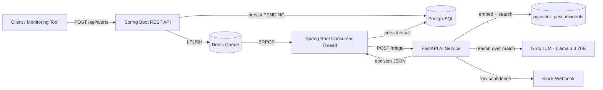

# Autonomous Incident Triage System

> A hybrid **Spring Boot + Python (FastAPI)** system that ingests production incident alerts, retrieves similar past incidents using RAG (Retrieval-Augmented Generation), and uses an agentic decision layer to either auto-suggest a fix or escalate to a human via Slack.


---

## 📋 Table of Contents

- [What This Project Does](#what-this-project-does)
- [Project Status](#project-status)
- [Architecture](#architecture)
- [Why This Architecture?](#why-this-architecture)
- [Tech Stack](#tech-stack)
- [Project Structure](#project-structure)
- [How the Decision Logic Works](#how-the-decision-logic-works)
- [Database Schema](#database-schema)
- [Installation](#installation)
- [Running the Project](#running-the-project)
- [API Reference](#api-reference)
- [Architecture Decisions](#architecture-decisions)
- [Roadmap](#roadmap)
- [Author](#author)

---

## What This Project Does

When a production system throws an error, an on-call engineer usually has to manually figure out: *"Have we seen this before? What fixed it last time? Is this even worth waking someone up for?"*

This system automates that first triage step:

1. An alert (a raw log/error message) comes in through a REST API.
2. It's queued and picked up asynchronously by an AI service.
3. The AI service embeds the alert and searches a vector database of past resolved incidents for semantically similar cases (not just keyword matches).
4. An agentic decision layer reasons over the retrieved matches and decides:
   - **High confidence match found** → auto-suggest the fix that worked last time.
   - **No good match / genuinely novel issue** → escalate to a human via Slack.
5. The full decision — including the reasoning and the matched past incident — is persisted for later review.

---

## Project Status

This project is being built incrementally, day by day, with a focus on understanding every layer rather than scaffolding it with a template. Current status:

| Component | Status |
| --- | --- |
| FastAPI service (Python) — alert ingestion endpoint | Done |
| LLM-based severity/category classification | Done |
| RAG pipeline — embeddings + pgvector similarity search | Done |
| Synthetic incident knowledge base (80 seeded incidents) | Done |
| Agentic decision layer (hybrid threshold + LLM confidence) | Done |
| Slack escalation webhook | Done |
| Spring Boot ingestion API + Redis queue (producer/consumer) | Done |
| Spring Boot ↔ Python service integration (WebClient) | Done |
| End-to-end verified pipeline (Postman → Postgres) | Done |
| React dashboard | Done |
| Guardrails: rate limiting, human override, fallback hardening | Done |
| Deployment (Render/Railway/Supabase/Vercel) | 🔜 Planned |

---

## Architecture



The system is split into two independently runnable services that share a single PostgreSQL database:

- **Spring Boot** owns ingestion, queueing, orchestration, and persistence of the final decision.
- **Python (FastAPI)** owns everything AI-related: embeddings, vector search, LLM reasoning, and the agentic decision.

---

## Why This Architecture?

**Why hybrid Java + Python instead of one stack end-to-end?**

This mirrors a common real-world pattern (polyglot microservices): core business logic in a statically-typed, enterprise-grade stack (Java/Spring Boot), and AI/ML-specific work in the ecosystem that's actually built for it (Python — mature libraries for embeddings, pgvector clients, LLM SDKs). Each half of the system plays to its stack's strengths rather than forcing one language to do everything reasonably well.

**Why Redis as a queue between ingestion and AI processing, instead of a direct synchronous call?**

LLM calls and vector search take anywhere from a few hundred milliseconds to a few seconds. If `POST /api/alerts` called the Python service synchronously and waited, a burst of incoming alerts would exhaust the web server's thread pool, and the ingestion API would become only as reliable as the (slower, LLM-dependent) AI service. Queueing decouples the two: ingestion always responds fast (`202 Accepted`), and processing happens asynchronously in the background. This is the same producer/consumer pattern used in the author's separate Distributed Job Queue project.

**Why pgvector instead of a dedicated vector database (Pinecone/Chroma/Weaviate)?**

The incident data is relational as much as it is semantic — source, timestamp, resolution status, and (eventually) foreign keys back to the Spring Boot side. Keeping vectors inside PostgreSQL means relational and vector data can be joined directly, with one less moving part in the infrastructure. At this project's scale (tens to low hundreds of incidents), the operational simplicity outweighs the raw performance ceiling a dedicated vector database would offer at much larger scale.

**Why a hybrid threshold + LLM confidence check for the decision layer, instead of pure vector similarity or pure LLM judgment?**

Pure cosine-distance thresholding is fast and predictable but can be fooled by wording that's superficially close but semantically different (or vice versa). Pure LLM judgment on every alert is more "intelligent" but adds latency and cost to every single request, including obviously-unrelated ones. The hybrid approach uses distance as a cheap pre-filter to reject clearly-unrelated alerts immediately, and only spends an LLM call reasoning about genuinely close candidates — cutting cost without sacrificing judgment on ambiguous cases.

---

## Tech Stack

**Backend (Spring Boot)**
- Java 17, Spring Boot 3.x
- Spring Web, Spring Data JPA (Hibernate)
- Spring Data Redis
- PostgreSQL driver
- Lombok
- `WebClient` (Spring WebFlux) for calling the Python service

**AI Service (Python)**
- FastAPI + Uvicorn (ASGI)
- Pydantic for request/response validation
- SQLAlchemy + `pgvector` (Python package) for ORM + vector column support
- `sentence-transformers` (`all-MiniLM-L6-v2`, 384-dim) for local embedding generation
- Groq API (Llama 3.3 70B) for classification and agentic reasoning
- `requests` for Slack webhook calls

**Infrastructure**
- PostgreSQL 16 + pgvector extension (Dockerized)
- Redis (Dockerized)
- Docker Desktop for local infra

---

## Project Structure

```text
Traige Project/
├── ai-service/                          # Python — AI/RAG/agent layer
│   ├── main.py                          # FastAPI app + all routes
│   ├── classifier.py                    # LLM-based severity/category classification
│   ├── embeddings.py                    # Text → 384-dim vector via sentence-transformers
│   ├── models.py                        # SQLAlchemy models (PastIncident) + DB session
│   ├── seed_data.py                     # LLM-generated synthetic incident seeding script
│   ├── retrieval.py                     # Top-k similar incident retrieval (cosine distance)
│   ├── agent.py                         # Agentic decision layer: threshold + LLM confirmation
│   ├── requirements.txt
│   └── .env                             # GROQ_API_KEY, DATABASE_URL, SLACK_WEBHOOK_URL
│
└── incident-triage-spring-service/
    └── incident-triage-service/
        └── src/main/java/com/pratham/incident_triage_service/
            ├── entity/
            │   ├── Alert.java           # Raw ingested alert (status: PENDING/PROCESSING/COMPLETED/FAILED)
            │   └── TriageResult.java    # Final decision, linked to Alert by alertId
            ├── repository/
            │   ├── AlertRepository.java
            │   └── TriageResultRepository.java
            ├── dto/
            │   ├── AlertRequest.java    # Inbound request DTO (validated)
            │   └── TriageResponse.java  # Maps Python's snake_case JSON via @JsonProperty
            ├── controller/
            │   └── AlertController.java # POST /api/alerts, GET /api/alerts/{id}
            ├── service/
            │   ├── AlertQueueProducer.java  # LPUSH to Redis
            │   └── AlertQueueConsumer.java  # Daemon thread: BRPOP → WebClient → persist
            ├── config/
            │   ├── RedisConfig.java     # RedisTemplate<String, String> bean
            │   └── WebClientConfig.java # WebClient bean
            └── IncidentTriageServiceApplication.java
```

---

## How the Decision Logic Works

For every alert, the AI service runs a two-stage decision process:

1. **Retrieve** the single closest past incident from `past_incidents` using pgvector's cosine distance operator (`<=>`) against the alert's embedding.
2. **Threshold pre-filter** — if the distance exceeds a tuned cutoff (currently `0.4`), the candidate is considered too dissimilar and the alert is escalated immediately, without spending an LLM call.
3. **LLM confirmation** — if the candidate passes the threshold, the LLM is given both the new alert and the candidate incident and asked to judge, in its own reasoning, whether they're genuinely the same underlying issue. This catches cases where the vector search finds something numerically close but conceptually different.
4. **Fail-safe default** — if the LLM's response can't be parsed as valid JSON, the system defaults to escalation rather than silently trusting an unverified match. Suggesting the wrong fix is worse than sending one extra alert to a human.

```python
DISTANCE_THRESHOLD = 0.4

def make_decision(alert_message: str) -> dict:
    top_match, distance = get_top_match_with_distance(alert_message)

    if top_match is None or distance > DISTANCE_THRESHOLD:
        return escalate(...)

    llm_verdict = llm_confirm_match(alert_message, top_match)
    if llm_verdict["is_match"]:
        return auto_suggest_fix(...)
    else:
        return escalate(...)
```

---

## Database Schema

Both services share a single PostgreSQL database (`triage_db`).

**Owned by the Python AI service:**

| Table | Purpose |
| --- | --- |
| `past_incidents` | Knowledge base of resolved incidents: `log_message`, `severity`, `category`, `resolution`, `embedding VECTOR(384)` |

**Owned by the Spring Boot service:**

| Table | Purpose |
| --- | --- |
| `alerts` | Raw ingested alerts with lifecycle status: `PENDING` → `PROCESSING` → `COMPLETED` / `FAILED` |
| `triage_results` | Final decision per alert: `decision`, `suggested_resolution`, `reasoning`, `confidence_distance`, linked via `alertId` |

---

## Installation

### Prerequisites

- Java 17+, Maven
- Python 3.10+
- Docker Desktop
- A Groq API key ([console.groq.com](https://console.groq.com))
- (Optional) A Slack app with an Incoming Webhook

### Infrastructure (Docker)

```bash
docker run --name triage-postgres -e POSTGRES_PASSWORD=<password> -p 5432:5432 -d pgvector/pgvector:pg16
docker run --name triage-redis -p 6379:6379 -d redis
```

Enable the `vector` extension inside the database:

```bash
docker exec -it triage-postgres psql -U postgres
```
```sql
CREATE DATABASE triage_db;
\c triage_db
CREATE EXTENSION vector;
```

### AI Service (Python)

```bash
cd ai-service
python -m venv venv
venv\Scripts\Activate.ps1     # Windows
# source venv/bin/activate    # Mac/Linux
pip install -r requirements.txt
```

Create `ai-service/.env`:
```env
GROQ_API_KEY=your_key_here
DATABASE_URL=postgresql://postgres:<password>@localhost:5432/triage_db
SLACK_WEBHOOK_URL=https://hooks.slack.com/services/your/webhook/url
```

Create tables and seed the knowledge base:
```bash
python models.py
python seed_data.py
```

### Spring Boot Service

Configure `src/main/resources/application.properties`:
```properties
spring.datasource.url=jdbc:postgresql://localhost:5432/triage_db
spring.datasource.username=postgres
spring.datasource.password=<password>
spring.jpa.hibernate.ddl-auto=update
spring.data.redis.host=localhost
spring.data.redis.port=6379
python.service.url=http://localhost:8000
server.port=8080
```

---

## Running the Project

**AI Service** (from `ai-service/`):
```bash
uvicorn main:app --reload --port 8000
```

**Spring Boot Service** — run `IncidentTriageServiceApplication` from your IDE, or:
```bash
./mvnw spring-boot:run
```

Both services must be running simultaneously, along with the two Docker containers.

---

## API Reference

### Spring Boot (`localhost:8080`)

| Endpoint | Method | Description |
| --- | --- | --- |
| `/api/alerts` | `POST` | Ingest a new alert. Persists it, queues it, returns `202 Accepted` immediately. |
| `/api/alerts/{id}` | `GET` | Fetch a single alert by ID. |

**Example request:**
```json
POST /api/alerts
{
  "source": "payment-service",
  "message": "Timeout connecting to Postgres primary node, retrying after 30s"
}
```

### Python AI Service (`localhost:8000`)

| Endpoint | Method | Description |
| --- | --- | --- |
| `/health` | `GET` | Health check. |
| `/alerts/classify` | `POST` | Classify a log message into severity + category. |
| `/triage` | `POST` | Full RAG + agentic decision pipeline for a log message. Called internally by the Spring Boot consumer. |

Interactive docs available at `localhost:8000/docs` (auto-generated Swagger UI).

---

## Architecture Decisions

- **Why FastAPI over Flask/Django?** — ASGI-based (via Starlette + Uvicorn), so I/O-bound work like LLM calls and DB queries doesn't block a worker thread the way a traditional WSGI framework would. Pydantic gives automatic request validation and free OpenAPI docs.
- **Why Groq over OpenAI?** — Free tier with fast inference (LPU hardware), sufficient for a project at this scale, avoiding paid API costs during development.
- **Why `sentence-transformers` locally instead of an embedding API?** — No per-call cost, works offline, and at this project's volume the latency difference versus an API call is negligible. It also demonstrates comfort running local ML inference, not just calling hosted APIs.
- **Why store the raw cosine distance, not just the decision?** — Persisting `confidence_distance` alongside the decision makes the system's reasoning auditable after the fact — useful both for debugging threshold tuning and for eventually showing "why" in the dashboard.
- **Why a hand-rolled agent loop instead of LangGraph?** — Building the state transitions manually first ensures the underlying mechanism (retrieve → threshold → LLM confirm → act) is fully understood before reaching for a framework that would otherwise abstract it away. A LangGraph version is a candidate follow-up once the core logic is solid.
- **Why no `@ManyToOne` relationship between `Alert` and `TriageResult`?** — A plain `alertId` foreign key column was a deliberate simplicity trade-off; full JPA relationship mapping wasn't needed at this scale and would have added ORM overhead without a corresponding benefit.

---

## Roadmap

- [ ] **React dashboard** — list of alerts with their triage decision, confidence score, and the retrieved "why" (source incident).
- [ ] **Guardrails** — human-in-the-loop override for auto-suggested fixes, rate limiting on ingestion, hardened fallback behavior when the LLM call fails outright (not just when it returns malformed JSON).
- [ ] **Retry / dead-letter handling** — currently a failed alert is marked `FAILED` and not retried; a bounded-retry + DLQ pattern (reusing ideas from the author's Distributed Job Queue project) is planned.
- [ ] **Deployment** — Spring Boot + Python services on Render/Railway, database on Supabase/Neon (pgvector-compatible), frontend on Vercel.
- [ ] **LangGraph variant** — an alternative implementation of the agent using LangGraph, to compare against the hand-rolled state machine.

---

## Author

Built by **Pratham Ahuja** — B.E. Information Science & Engineering, NIE Mysore.

This project is being built and documented incrementally as a learning exercise in Python, RAG pipelines, and agentic AI systems, on top of an existing Java/Spring Boot backend background.
